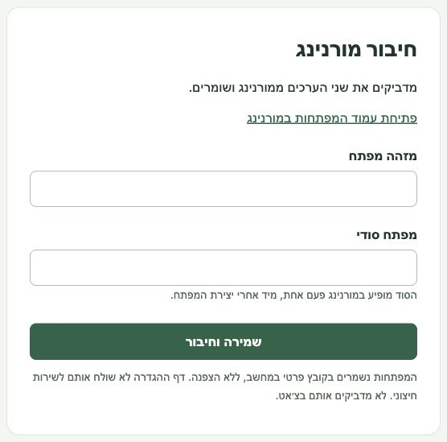

<h1 dir="rtl" align="right">morning (green invoice) mcp</h1>

mcp למערכת ניהול חשבונות מורנינג (לשעבר חשבונית ירוקה)

חיבור מקומי בין מורנינג (חשבונית ירוקה) לסוכני AI כמו Codex ו־Claude. כל משתמש מתקין במחשב שלו ומחבר את מפתחות ה־API של החשבון שלו. אין הרשמה נוספת.

## מה אפשר לעשות?

- לחפש לקוחות, חשבוניות והוצאות.
- להכין חשבוניות ומסמכים נוספים, להפיק ולשלוח אחרי אישור.
- להעלות קבלות והוצאות מקובצי PDF, JPEG או PNG עד 20MB.
- ליצור ולעדכן לקוחות, פריטים ופרטים נוספים דרך ה־API.

הסוכן מכין טיוטה. אתם בודקים ומאשרים בחלון של הסוכן לפני שהשינוי מתבצע במורנינג. האישור נדרש בקוד השרת. [רשימת הפעולות והחריגים](API-COVERAGE.md).

## 1. מתקינים בעזרת הסוכן

מעתיקים ל־Codex או ל־Claude Code שמותקן במחשב:

<pre dir="ltr" align="left"><code>Install Morning MCP and connect it to the agent we're using:
https://github.com/ishayshalev/morning-mcp

Read docs/INSTALL-AGENT.md and follow its instructions.
Open the local setup page. I will paste my Morning API key ID and secret there myself.
Do not ask for keys in chat or read the credentials file.
Do not enable automatic approvals.</code></pre>

צריך macOS או Linux, ‏Node.js 22 ומעלה ו־Git. הסוכן יעזור להתקין אם חסר משהו. אפשר לחבר גם Claude Desktop ולקוחות MCP מקומיים אחרים. ביצוע שינויים דורש לקוח שתומך בחלון אישור MCP.

## 2. יוצרים מפתח במורנינג

פותחים **[אזור אישי ← כלים למפתחים ← מפתחות API](https://app.greeninvoice.co.il/settings/developers/api)**. לוחצים על **+**, נותנים שם, קוראים ומאשרים את התנאים ושומרים.

מעתיקים את **מזהה המפתח** ואת **המפתח הסודי**. הסוד מוצג פעם אחת בלבד, מיד אחרי יצירת המפתח. [הרשאות ומסלולים במורנינג](https://www.greeninvoice.co.il/help-center/generating-api-key/).

צילומים: איפה יוצרים ומעתיקים?

במסך המפתחות לוחצים על המזהה להעתקה. הסוד מופיע בחלון שאחרי יצירת המפתח.

ערכי המפתח אינם כלולים בצילום. [מדריך מצולם מלא](docs/setup-guide.html), לפתיחה מקומית בדפדפן.

## 3. מדביקים ומתחילים

הסוכן יפתח עמוד הגדרה מקומי בדפדפן. מדביקים **מזהה מפתח** ו־**מפתח סודי**, ולוחצים **שמירה וחיבור**. אין עוד הגדרות. אחרי השמירה תופיע הודעת **המפתחות נשמרו**. אם השמירה לא הצליחה, הטופס יציג שגיאה.

המפתחות נשמרים במחשב שלכם. לא מדביקים אותם בצ׳אט. אם העמוד לא נפתח, הסוכן ייתן קישור מקומי; הוא תקף לעשר דקות.

איפה מדביקים את המפתחות?

חוזרים לסוכן ואומרים שסיימתם. הוא יבדוק שהחיבור למורנינג עובד. אם הכלים עדיין לא מופיעים בסוכן, מחברים מחדש את ה־MCP. אפשר לבקש:

> תכין טיוטת חשבונית ללקוח הזה על הפרויקט האחרון.

> תכין את הקבלות בתיקייה הזאת להעלאה למורנינג.

בודקים ומאשרים בחלון של הסוכן. טיוטת הוצאה שנוצרה מהעלאת קובץ משלימים במורנינג.

## פרטים חשובים

זה עדיין MVP. מנגנון האישור נבדק דרך פרוטוקול MCP, כולל סירוב, בקשות כפולות ושינוי טיוטה. חלון האישור בתוך Codex ו־Claude ופעולות בחשבון מורנינג אמיתי עדיין דורשים בדיקה עם המשתמש. [מה נבדק](docs/TESTING.md). המפתחות נשמרים בקובץ מקומי פרטי ללא הצפנה; הטיוטות והקבצים אינם נמחקים אוטומטית. אין להגדיר אישורים אוטומטיים.

[התקנה ידנית והגדרות נוספות](docs/advanced.md) · [דיווח תקלה](https://github.com/ishayshalev/morning-mcp/issues) · [רישיון MIT](LICENSE)

פרויקט עצמאי, אינו מוצר רשמי של מורנינג.

