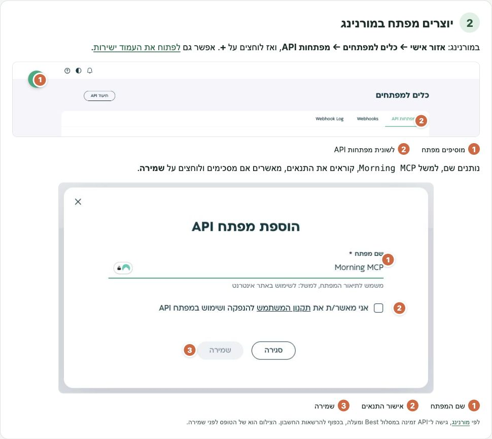
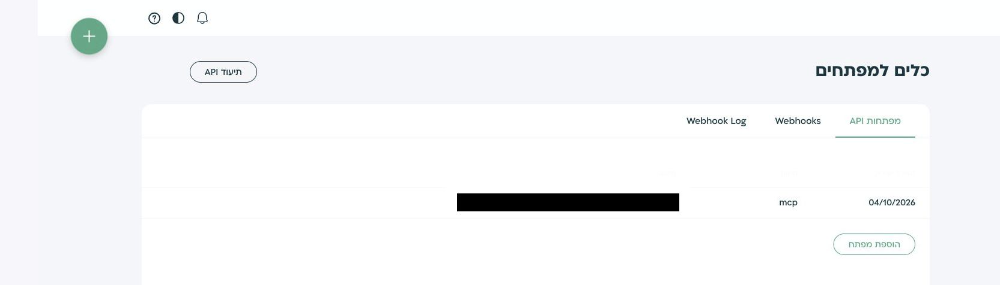
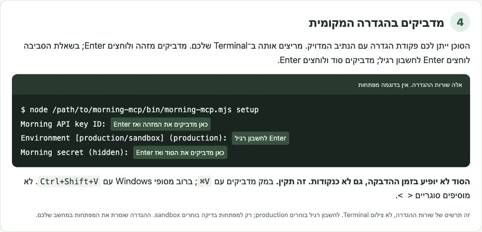

# מורנינג, מתוך קלוד או Codex

אני משתמש במורנינג בעיקר בשביל חשבוניות והוצאות. רציתי פשוט להגיד לסוכן מה צריך לעשות, לקבל טיוטה ולעבור עליה לפני שאני מאשר.

אז בניתי חיבור שמאפשר לעשות את זה.

אפשר לחפש לקוחות וחשבוניות, להכין חשבונית ללקוח, להעלות קבלות והוצאות, ולעדכן פרטים. **הסוכן מכין. אתם מאשרים. רק אז הפעולה מתבצעת במורנינג.**

## איך מתחילים?

מעתיקים את זה ל־Codex או ל־Claude Code שמותקן במחשב:

<pre dir="rtl"><code>התקן לי את Morning MCP וחבר אותו לסוכן שבו אנחנו עובדים:
https://github.com/ishayshalev/morning-mcp

קרא את docs/INSTALL-AGENT.md ופעל לפי ההוראות.
את מפתחות מורנינג אכניס בעצמי ב־Terminal. אל תבקש אותם בצ׳אט ואל תקרא את קובץ המפתחות.
אל תגדיר אישורים אוטומטיים.</code></pre>

הסוכן יתקין את החיבור ויגדיר אותו. אחר כך תכניסו את המפתחות בעצמכם, במחשב שלכם. לא צריך להוריד קובץ ידנית או להירשם לעוד מערכת.

צריך Node.js 22 ומעלה ו־Git. אם משהו חסר, הסוכן יעזור בהתקנה. אפשר לחבר גם Claude Desktop ולקוחות MCP מקומיים אחרים; בשביל לבצע שינויים הם צריכים לתמוך בחלון אישור. החיבור מיועד כרגע ל־macOS ול־Linux.

## מאיפה מביאים את המפתחות?

במורנינג נכנסים ל־**אזור אישי ← כלים למפתחים ← מפתחות API**. [הנה קיצור דרך](https://app.greeninvoice.co.il/settings/developers/api).

לוחצים על **+**, נותנים שם למפתח, קוראים ומאשרים את התנאים ושומרים. מקבלים שני דברים: **מזהה מפתח** ו־**מפתח סודי**.

הסוכן ייתן לכם פקודת הגדרה להרצה ב־Terminal. מדביקים שם את המזהה, לוחצים Enter לחשבון רגיל, ואז מדביקים את הסוד. **הסוד לא יופיע בזמן ההדבקה. זה תקין.**

הסוד מוצג במורנינג פעם אחת בלבד, אז שומרים אותו במקום בטוח. לא מדביקים מפתחות בצ׳אט.

רוצים לראות איפה לוחצים ומה מדביקים?

במסך המפתחות לוחצים על המזהה להעתקה. הסוד מופיע רק בחלון שאחרי יצירת המפתח.

הצילום מושחר וערכי המפתח אינם כלולים בקובץ. [המדריך המלא עם הצילומים](docs/setup-guide.html) זמין גם לפתיחה מקומית בדפדפן. [הוראות מורנינג](https://www.greeninvoice.co.il/help-center/generating-api-key/) כוללות גם את המסלולים וההרשאות הנדרשים.

## וזהו. מה אומרים לסוכן?

> תכין חשבונית ללקוח הזה על הפרויקט האחרון. תראה לי את הטיוטה לפני שאתה מפיק ושולח.

או:

> יש לי תיקייה עם קבלות מהחודש. תכין אותן להעלאה למורנינג ותבקש ממני אישור.

אתם בודקים את הפרטים ומאשרים בחלון של הסוכן. טיוטת הוצאה שנוצרה מהעלאת קובץ משלימים במורנינג.

זה עדיין MVP. בדיקות תאימות מול הסוכנים וביצוע פעולות חיות עוד לא נעשו. המפתחות והטיוטות נשמרים מקומית במחשב; המפתחות נשמרים בקובץ פרטי ולא בכספת מוצפנת.

[מה עוד אפשר לעשות](API-COVERAGE.md) · [הגדרות ופרטים נוספים](docs/advanced.md) · [משהו לא עובד?](https://github.com/ishayshalev/morning-mcp/issues)

בניתי את זה לשימוש שלי ופתחתי גם לאחרים. זה פרויקט עצמאי, לא מוצר רשמי של מורנינג. [רישיון MIT](LICENSE).

